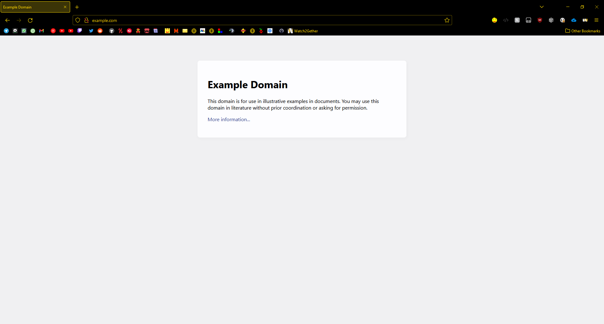
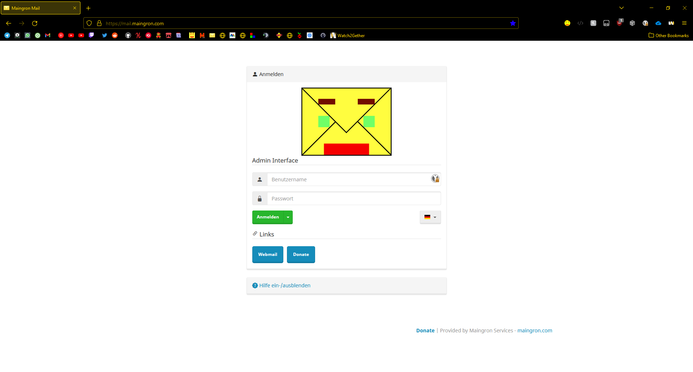
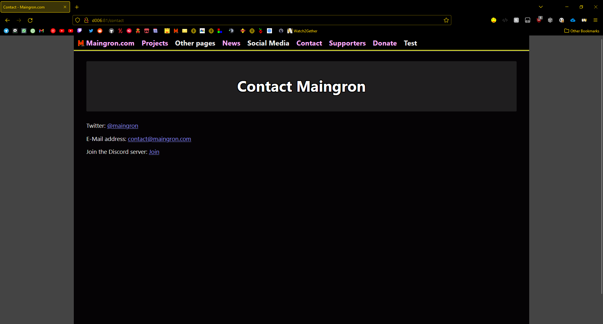

This is the readme file for this project.

## Screenshots

This is Screenshot 1. If we're using dark mode, it will always switch from "light" folder to "dark" folder, but only if the image exists in both folders. Same goes vice versa.

